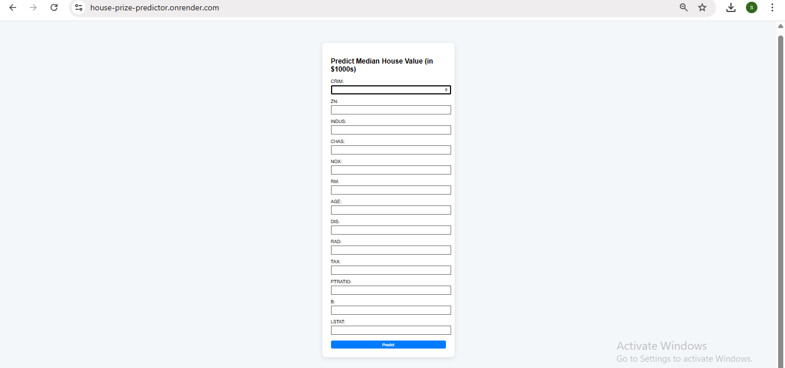
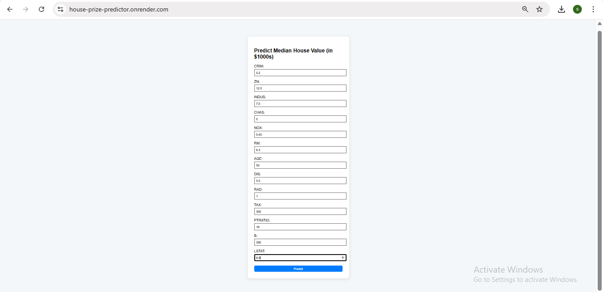
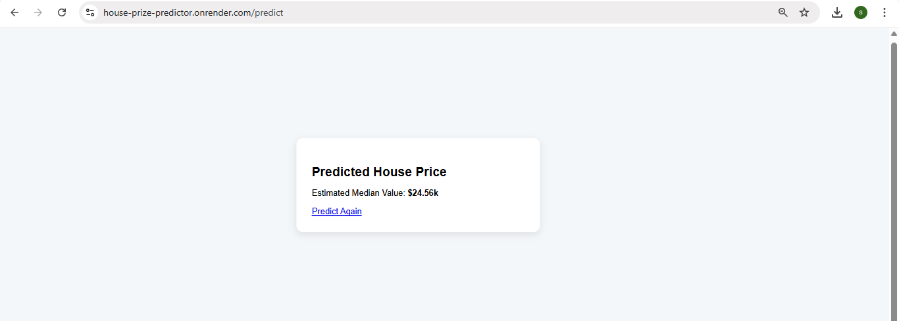

# Iris-flower-prediction

This project is a web-based application that predicts the median house price in Boston suburbs using Lasso Regression. It is built using a machine learning model trained on the Boston Housing dataset and deployed via a Flask web app. Lasso Regression is used here to perform both prediction and feature selection, making the model more interpretable and robust.

---

## Features

- Predicts Boston house prices using Lasso Regression.
- Accepts 13 housing-related inputs through a web form.
- Handles missing values using automatic imputation.
- Provides a clean and responsive Flask-based UI.
- Easily deployed on Render with minimal setup.

---

## Prerequisites

Make sure the following are installed:

- Python 3.7 or higher installed
- Git installed and configured
- Basic knowledge of Python and Flask
- A GitHub account (for code hosting)
- Render account (for deployment)

---

## Installation

### 1. Clone the repository

```
git clone https://github.com/sandhiya0147/house-prize-predictor.git
cd house-prize-predictor
```

### 2. Install dependencies

```
pip install -r requirements.txt
```

---

## Running the Application

Start the Flask development server:

```
python app.py
```

Then open your browser and go to:

```
http://127.0.0.1:5000
```

---

## How It Works

- The user enters 13 housing features (e.g., crime rate, rooms, tax) into a web form.
- The Flask app collects the input and converts it into a format suitable for the model.
- The model pipeline processes the input: handles missing values, scales features, and applies Lasso Regression.
- The trained model predicts the median house price based on the inputs.
- The predicted price is displayed back on the result page in the browser.

---

## File Structure

```
house-pize-predictor
├── app.py
├── model_train.py
├── model.pkl
├── housing.csv
├── requirements.txt
├── Procfile
├── README.md
├── static/
│   └── style.css
├── templates/
│   ├── home.html
│   └── result.html
         
```

---

## Future Improvements

- Add data visualization to help users understand how features impact price.
- Integrate multiple models (e.g., Ridge, Random Forest) for comparison and ensemble predictions.
- Enable CSV upload to allow batch predictions for multiple properties.
- Improve input validation and UX using JavaScript and form tooltips.
- Build a database connection to store user inputs and prediction history.

---


## Step-by-Step Guide: How to Use the Movie Interest Predictor


### Step 1: Input Form
  

### Step 2: Filled Form 
  

### Step 3: Prediction Result


---

## Live Demo

[Click here to view the deployed app](https://house-prize-predictor.onrender.com)

---
